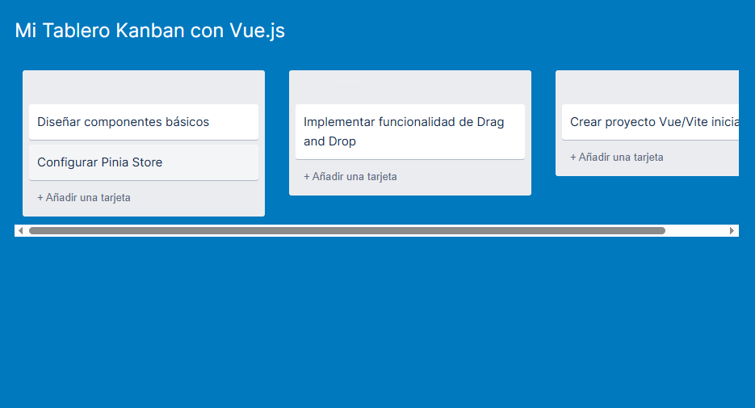

<h1 align="center">
    TABLERO KANBAN COLABORATIVO CON VUE.JS
</h1>
 
 

**🚀 VUE KANBAN BOARD** 
 
Este proyecto es una implementación moderna y funcional de un tablero Kanban estilo Trello, desarrollado completamente 
con el ecosistema de Vue.js 3. 
Sirve como demostración de gestión de estado centralizado, componentes reutilizables y manipulación avanzada del DOM 
mediante Drag and Drop nativo.
 
 

**✨ CARACTERISTICAS DESTACADAS**
 
| Característica | Tecnología / Concepto Demostrado |
| :--- | :--- |
| **Gestión de Estado** | **Pinia (Composition API):** Centralización del estado de todo el tablero, asegurando la reactividad en toda la aplicación. |
| **Arrastrar y Soltar** | **API Nativa de HTML5 Drag and Drop:** Implementación de la lógica de movimiento de tarjetas entre listas con sincronización de Pinia. |
| **Testing Unitario** | **Vitest & JSDOM:** Implementación de pruebas unitarias para validar la lógica de negocio del Pinia Store. |
| **Routing Dinámico** | **Vue Router:** Uso de rutas dinámicas (`/card/:id`) para simular la apertura de un modal de detalle de tarea. |
| **CRUD Básico** | Implementación de las funcionalidades **Crear**, **Leer**, **Actualizar** y **Mover** tareas de forma completa. |
 
 

**🛠️ STACK TECNOLOGICO**
 
* Framework Principal: Vue.js 3 (Composition API & <script setup>)
* Gestión de Estado: Pinia
* Routing: Vue Router
* Build Tool: Vite
* Estilización: CSS Puro (<style scoped>)
* Utilidades: nanoid para la generación de IDs únicos.
 
 

**⚙️ INSTALACION Y USO**
 
Sigue estos pasos para levantar el proyecto en tu máquina local:
1. Clonar el repositorio:
    
   git clone [https://github.com/Maicol843/Gestion_de_tareas_colaborativa/]
    
   cd vue-kanban
    
2. Instalar dependencias:
    
   *npm install*
    
3. Ejecutar el servidor de desarrollo:
    
   *npm run dev*
 
El proyecto se abrirá en tu navegador en http://localhost:5173/
 
 
 

**➡️ PROXIMOS PASOS (Opcionales para el Desarrollo)**
 
* Persistencia de datos usando LocalStorage o integrando un backend (ej. Firebase/Supabase).
* Mejorar la precisión del Drag and Drop (poder soltar tarjetas entre otras tarjetas, no solo al final).
* Añadir filtros de búsqueda y opciones de ordenamiento de tarjetas.
 
 

  

 
 

**👤 AUTOR**
 
[Maicol Daniel Mamani Chalco]
 
* Github: [https://github.com/Maicol843/]
* Linkrdin: [https://www.linkedin.com/in/maicolchalco]
